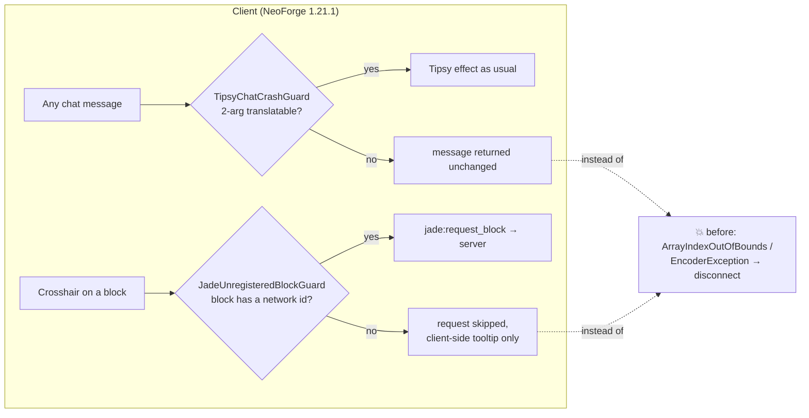

<p align="center"></p>

<div align="center">


[](https://github.com/VOIDRP-MINECRAFT/voidrp-client-fixes/actions/workflows/build.yml)

</div>

A **client-only** NeoForge 1.21.1 mod that houses crash guards and compatibility
patches for buggy client-side behaviour in the VoidRP (FTB Evolution) modpack.

It is **not required on the server**: its dependencies are `side="CLIENT"` and it
declares `displayTest="IGNORE_ALL"`, so a client carrying it can join a server that
does not have it installed without any mod-list mismatch.

## At a glance

| Mixin | Mod it guards | Symptom without it |
|---|---|---|
| `TipsyChatCrashGuardMixin` | Brewin' And Chewin' | **Every** client disconnects whenever anyone sends a plugin-formatted chat message |
| `JadeUnregisteredBlockGuardMixin` | Jade | Looking at a block with no network id (Epic Fight's terrain fracture) drops the connection |



Both guards only change behaviour in the exact case that used to crash; everything else is untouched.
The mod declares `displayTest="IGNORE_ALL"`, so a client with it joins a server without it.

## Fixes

### `TipsyChatCrashGuardMixin` — Brewin' And Chewin' Tipsy chat crash

Brewin' And Chewin''s Tipsy chat handler (`TipsyEffects.iCanHear`) calls
`getChatMessage(msg)` unconditionally for every received chat message, and
`getChatMessage` assumes the message is a vanilla `chat.type.text` translatable
component with two args `[sender, content]`, reading `getArgs()[1]`. When the server
formats chat into a component that is not a 2-arg translatable (e.g. a plugin-formatted
chat message), `args[1]` is out of bounds:

```
java.lang.ArrayIndexOutOfBoundsException: Index 1 out of bounds for length 1
  at umpaz.brewinandchewin.neoforge.client.TipsyEffects.getChatMessage(TipsyEffects.java:50)
```

Since this runs on every client for every chat message, it disconnects **everyone**
whenever anyone talks. The mixin guards `getChatMessage`: if the message is not a
2-arg translatable it is returned unchanged (no garble, no crash). Well-formed vanilla
chat is untouched, so the Tipsy effect keeps working.

### `JadeUnregisteredBlockGuardMixin` — Jade disconnects on a block with no network id

Epic Fight's terrain-fracture effect (the cracked ground left by a heavy weapon skill) places a
`FractureBlock` that is not in the synced block registry. Jade's crosshair tooltip packs the looked-at
`BlockState` into `jade:request_block`; encoding that block throws on the Netty thread and vanilla
drops the connection — so merely *looking at* the cracks kicked the player:

```
io.netty.handler.codec.EncoderException: Failed to encode packet 'serverbound/minecraft:custom_payload'
Caused by: Failed encoding custom payload jade:request_block
Caused by: IllegalArgumentException: Can't find id for 'Block{epicfight:fracture_block}'
```

The mixin skips the request when the block has no id; Jade shows what it can derive client-side
for that one block. The server never sees the packet and is unaffected.

## Build

```bash
./gradlew build
# → build/libs/voidrp_client_fixes-1.0.0.jar
```

Install into the **client** modpack only.
